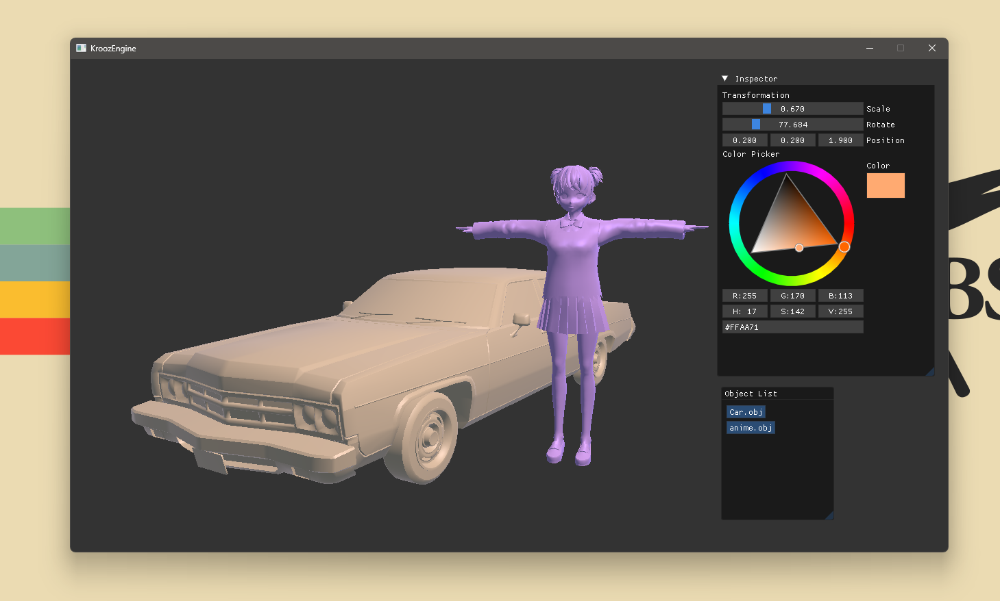

## VoidGL - OpenGl Based Basic Engine
This is a learning project for Modern OpenGL, aimed at understanding rendering pipelines, shaders, and scene management.

</img>

# Get It Runinng:
```
git clone https://github.com/somKrooz/VoidGl.git
cd VoidGl
make
```


